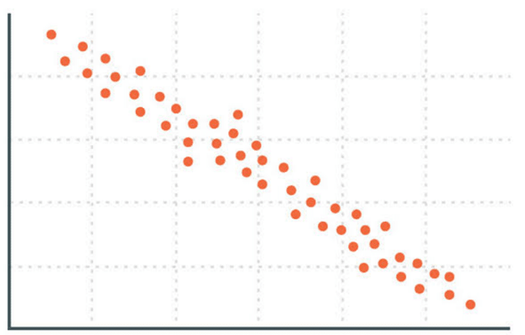

# ryx



<!-- badges: start -->

<!-- badges: end -->

The goal of ryx is to provide tools for exploring and analyzing the
correlations between a selected variable and other numeric variables in
a dataset. Users can choose specific numeric variables to include in the
comparison. If none are specified, the selected variable will be
compared to all other numeric variables in the dataset, excluding
itself. The plot function generates visualizations to clearly represent
these correlations, highlighting their direction and magnitude. The
summary function returns a comprehensive summary, including the
variables being compared, the median absolute correlation, the range of
correlation values, and the count of variables that are statistically
significant at below the 0.05 level. Additionally, the print function
outputs the correlation values between the selected variable and the
other variables in the dataset for easy review.

## Installation

You can install the development version of ryx from [Github]
(<https://github.com/ralr17/ryx2.git>) with:

``` r
# install.packages("remotes")
remotes::install_github("https://github.com/ralr17/ryx2.git")
```
## How to use

To learn more about how to use this package and the different functions available to anaylze the correlation between variables visit the Getting Started tab and the Reference tab.
